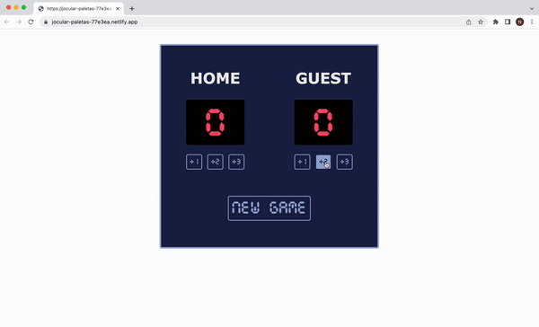

# Basketball scoreboard

Basketball scoreboard is used to add points to the teams during a basketball game.

## Features
Users can press the buttons to add 1, 2 or 3 points to the Home or Guest teams. There is also a New Game button available that resets the scores.

## Demo

Test it on Netlify: https://jocular-paletas-77e3ea.netlify.app/

## Technologies
The project is built using:
* HTML
* CSS
* JavaScript

## Project status
The project is complete.

## Acknowledgements
Basketball scoreboard is a solo project that was part of [the Frontend Developer Career Path at Scrimba](https://scrimba.com/learn/frontend).

## Contact
Created by [Natalia Davtyan](https://github.com/nataliadavtyan)
